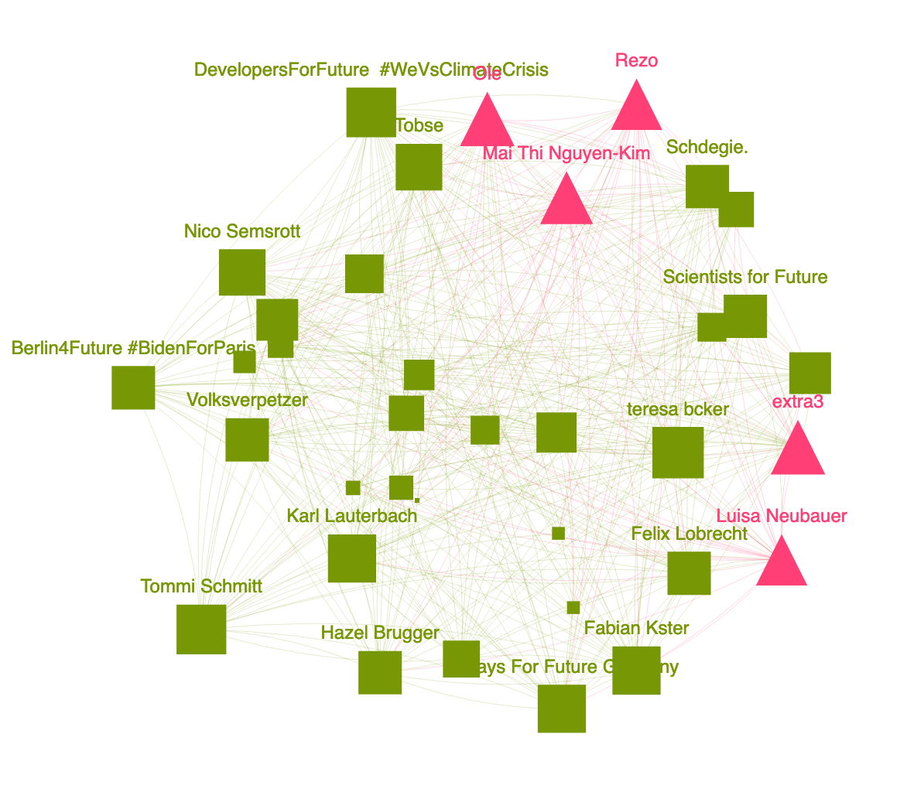

# Tobi's Twitter Network



This is a project about Tobi's Twitter Network. The question we asked ourselves is: "Which people (accounts) are influencing Tobis Feed the most?". To answer this question we are using methods of the Social Network Analysis. Our first approach is to collect all friends (people which Tobi is following) and check which of his friends has overlapping friends. The second approach is to just create a network with all friends and friends of friends (2nd-grade friends) from Tobi and calculate the centrality degree of each node.

## Documentation as PDF
To get the Documentation as PDF just click [here](http://dev.christopherlohse.de/SocialNetworkAnalysis/Documentation.pdf).

## Simple Access 

Just click [here](http://dev.christopherlohse.de/SocialNetworkAnalysis/) and you can enjoy the jupyter notebook of the Documentation as .html file.

## Installation steps

### Prerequisites

- python >= 3.7
- pip3 - The Python Package Installer 3

### Easy Setup

Type in the terminal in the repository folder:

``` bash
pip install requirements.txt
jupyter lab
```

After that, the jupyter lab interface should start and you can open twitterSNA.ipynb to view the notebook

## Error Handling and Backups

### View the notebook as HTML 

Just open the index.html file included in the repository in your browser or go to http://dev.christopherlohse.de/SocialNetworkAnalysis/ as described above.

### What if the visualisation doesn't show correctly

Open 1stVisualisation.html and 2ndVisualisation.html in The HTML folder or click
[here](http://dev.christopherlohse.de/SocialNetworkAnalysis/HTML/1stVisualisation.html) or 
[here](http://dev.christopherlohse.de/SocialNetworkAnalysis/HTML/2ndVisualisation.html) to view the graphic in big. It is also recommended to zoom in the visualisation in order to see all details correctly.


